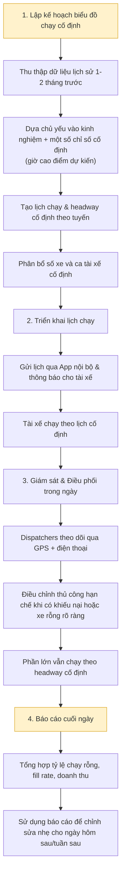
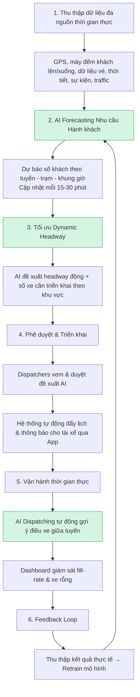

### Current state workflow

```mermaid
flowchart TD
    A[1. Lập kế hoạch biểu đồ chạy cố định] 
    --> B[Thu thập dữ liệu lịch sử 1-2 tháng trước]
    --> C["Dựa chủ yếu vào kinh nghiệm + một số chỉ số cố định<br/>(giờ cao điểm dự kiến)"]
    --> D[Tạo lịch chạy & headway cố định theo tuyến]
    --> E[Phân bổ số xe và ca tài xế cố định]

    E --> F[2. Triển khai lịch chạy]
    F --> G[Gửi lịch qua App nội bộ & thông báo cho tài xế]
    G --> H[Tài xế chạy theo lịch cố định]

    H --> I[3. Giám sát & Điều phối trong ngày]
    I --> J[Dispatchers theo dõi qua GPS + điện thoại]
    J --> K[Điều chỉnh thủ công hạn chế khi có khiếu nại hoặc xe rỗng rõ ràng]
    K --> L[Phần lớn vẫn chạy theo headway cố định]

    L --> M[4. Báo cáo cuối ngày]
    M --> N[Tổng hợp tỷ lệ chạy rỗng, fill rate, doanh thu]
    N --> O[Sử dụng báo cáo để chỉnh sửa nhẹ cho ngày hôm sau/tuần sau]

    style A fill:#FFF2CC,stroke:#DAA520
    style M fill:#FFF2CC,stroke:#DAA520
```

### Future state workflow

```mermaid
flowchart TD
    A[1. Thu thập dữ liệu đa nguồn thời gian thực] --> B[GPS, máy đếm khách lên/xuống, dữ liệu vé, thời tiết, sự kiện, traffic]

    B --> C[2. AI Forecasting Nhu cầu Hành khách]
    C --> D["Dự báo số khách theo tuyến - trạm - khung giờ<br/>Cập nhật mỗi 15-30 phút"]

    D --> E[3. Tối ưu Dynamic Headway]
    E --> F[AI đề xuất headway động + số xe cần triển khai theo khu vực]

    F --> G[4. Phê duyệt & Triển khai]
    G --> H[Dispatchers xem & duyệt đề xuất AI]
    H --> I[Hệ thống tự động đẩy lịch & thông báo cho tài xế qua App]

    I --> J[5. Vận hành thời gian thực]
    J --> K[AI Dispatching tự động gợi ý điều xe giữa tuyến]
    K --> L[Dashboard giám sát fill-rate & xe rỗng]

    L --> M[6. Feedback Loop]
    M --> N[Thu thập kết quả thực tế → Retrain mô hình]
    N --> C

    style C fill:#D5F5E3,stroke:#27AE60
    style E fill:#D5F5E3,stroke:#27AE60
    style K fill:#D5F5E3,stroke:#27AE60
```